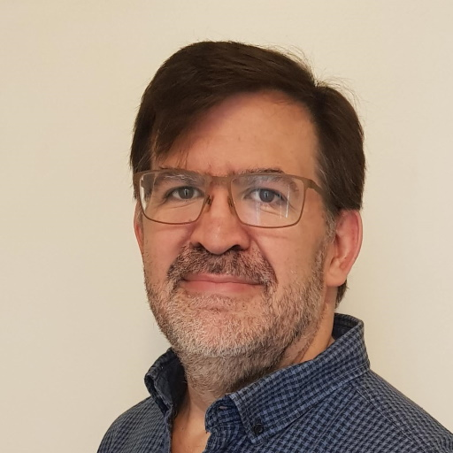

:sectanchors:
= Speaking engagements.

== Bio
[.text-right]

human, male, husband, father, programmer, geek, Full Stack Architect and Software Engineer with #SkinInTheGame

I have earned a living by programming since 1985 and have worked on very small embedded systems as well as mainframe systems and everything in between.

I have used a wide variety of programming languages and technologies to solve problems across very different domains. Recently mostly on the JVM in financial services, and now at VMware on the Spring Cloud Data Flow team.

I am passionate about developer productivity and have a severe allergic reaction to bureaucracy.

== Talks

=== 1. KFSM: A Kotlin DSL for Finite State Machines

- Have you ever drawn a state-diagram?
- Have you ever implemented a state-machine?
- Have you ever modified the state-machine after some time?

Join me on the journey of create a Kotlin DSL for Finite State Machines.

The session will demonstrate the coding of a simple FSM for Android or the Browser front-end or a Spring Backend depending on the audience vote.

=== 2. The care and feeding of Developers

==== The Pitch

Without developers, it will be impossible to move any business forward in a digital world.
How do you look after these strange creatures if you are a team lead, development manager or CTO?
How do you coach developers to look after themselves?
Looking after yourself as a developer.

==== Description

This talk will cover a range of topics that impact developer productivity and welfare.
How do you manage cognitive load?
How much multi-tasking can you do?
Are your teams effective?
How do you go faster?
What does the latest science say about human behaviour, productivity and working in teams.

=== 3. Sweet Streams are made of this.

== Social Media

++++
<a rel="me" href="https://hachyderm.io/@corneil">Mastodon</a> 
<a href="https://twitter.com/corneil">Twitter</a> 
<a href="https://www.linkedin.com/in/corneil">LinkedIn</a> 
++++
